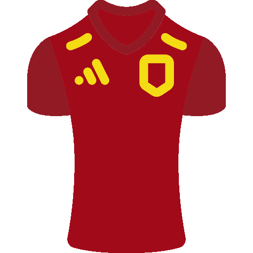
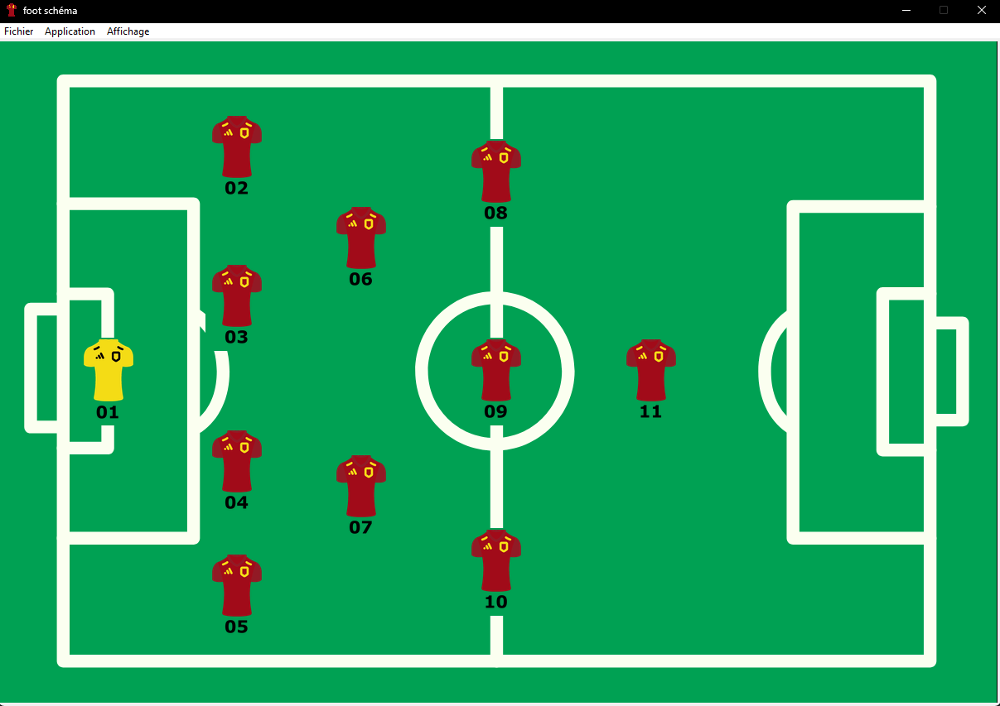
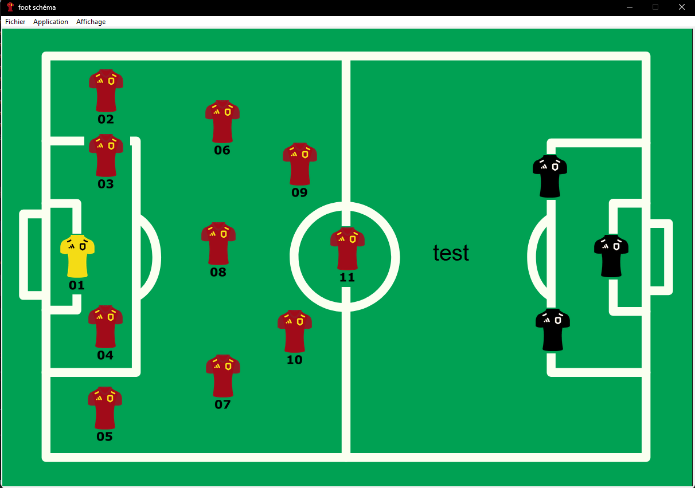

# footSchema 

footSchema is a Python application that utilizes the Tkinter library to create a user-friendly interface for designing football composition diagrams. The application allows you to drag and drop jerseys representing players, add text, and include opponents (not included by default). Once you have created your diagram, you can export it in PNG format.

## Key Features

- Drag and drop player jerseys onto the field.
- Add text to annotate the diagram.
- Incorporate opponents.
- Export the created diagram in PNG format.

## Screenshots

## Usage Example

Here's how to use the footSchema application:

1. Download the project from GitHub.
2. Navigate to the "build/exe.win-amd64-3.11" folder.
3. Run the executable file "project-football.exe."

## Sources

- <a href="https://www.python.org" rel="noreferrer">  Python </a> - The programming language used to develop the application.
- <a href="https://docs.python.org/fr/3/library/tkinter.html" rel="noreferrer">  tkinter </a> - The graphical library used to create the user interface.

## Contributions

Contributions to this project are welcome. If you'd like to contribute, please follow these steps:

1. Fork this repository.
2. Create a branch for your modifications.
3. Make your changes and test them.
4. Submit a pull request to the main branch.
